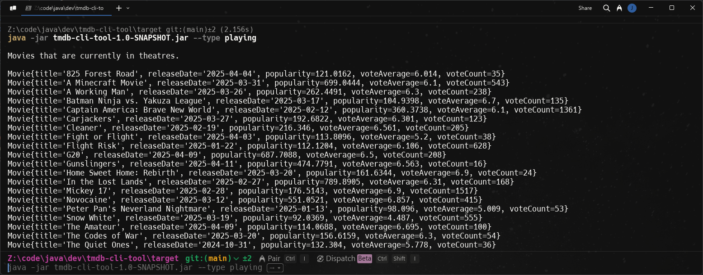
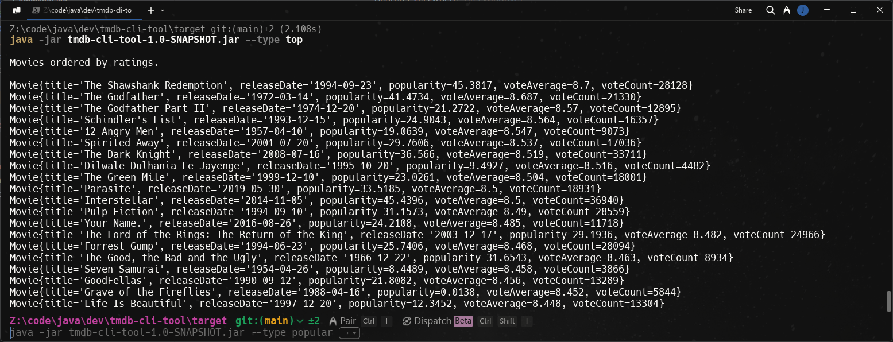

<div align="center">
  <h1 align="center"><a href="https://github.com/ASJordi/tmdb-cli-tool">TMDB CLI Tool</a></h1>

  <p align="center">CLI to fetch data from The Movie Database (TMDB) and display it in the terminal.</p>
</div>

## About :computer:

Simple command line interface (CLI) to fetch data from The Movie Database (TMDB) and display it in the terminal using Java.

 <br>


## Technologies :gear:

- Java 21
- [Jackson](https://github.com/FasterXML/jackson-databind/)
- Lombok

## Installation :floppy_disk:

> Make sure to have an API key from TMDB. You can get one by creating an account on [TMDB](https://www.themoviedb.org/) and following the instructions in their [API documentation](https://developer.themoviedb.org/docs/getting-started).

1. Clone the repository
2. Open the project in your favorite IDE
3. Add your TMDB API key in the `src/main/resources/api.properties` file
4. Run the project
5. Or build the project with Maven and run the generated jar.

```bash
mvn clean install
```

## Usage :hammer_and_wrench:

```bash
java -jar tmdb-cli-tool-1.0-SNAPSHOT.jar <command> [options]
```

### Examples :bulb:

```bash
# Show help
java -jar tmdb-cli-tool-1.0-SNAPSHOT.jar --h

# Playing
java -jar tmdb-cli-tool-1.0-SNAPSHOT.jar --type playing

# Popular
java -jar tmdb-cli-tool-1.0-SNAPSHOT.jar --type popular

# Top
java -jar tmdb-cli-tool-1.0-SNAPSHOT.jar --type top

# Upcoming
java -jar tmdb-cli-tool-1.0-SNAPSHOT.jar --type upcoming
```

## License :page_facing_up:

Distributed under the MIT License. See `LICENSE` for more information.

## Contact :email:

Jordi Ayala - [@ASJordi](https://twitter.com/ASJordi)

Project Link: [https://github.com/ASJordi/tmdb-cli-tool](https://github.com/ASJordi/tmdb-cli-tool)

Reference: [https://roadmap.sh/projects/tmdb-cli](https://roadmap.sh/projects/tmdb-cli)
